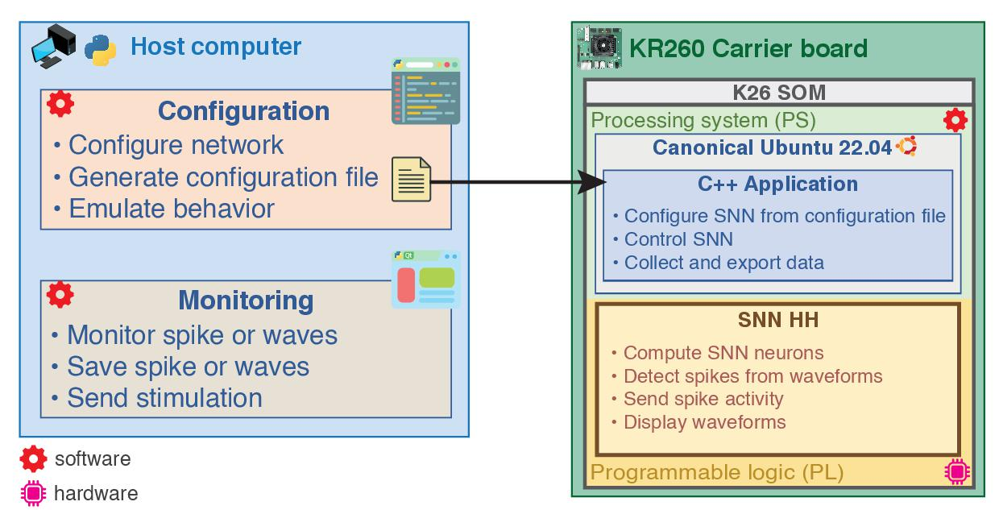
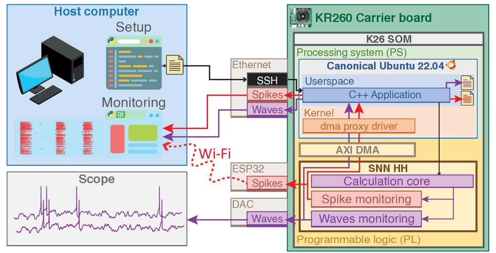

# BiœmuS: Biomimetic Emulation of Single compartment neurons

## Overview

BiœmuS is a biomimetic real-time Spiking Neural Network (SNN) emulating single compartment Hodgkin & Huxley neurons running on SoC FPGA (AMD Zynq UltraScale+ MPSoC).

_Maintainers_: Timothée Lévi (timothee.levi@u-bordeaux.fr)

_Authors_: Romain Beaubois (beaubois@iis.u-tokyo.ac.jp), Jérémy Cheslet (jeremy.cheslet@u-bordeaux.fr)

**Overview of the system architecture**


**Monitoring channels**


## Features

| Features          | Details       |
|-------------------|---------------|
| **Neurons**       | FS, RS, LTS, IB|
| **Synapses**      | AMPA, NMDA, GABAa, GABAb |
| **Targets**       | KR260, KV260 |
| **Setup**         | Network configuration file + AXI-Lite |
| **Spikes monitoring** | On-board file saving (DMA), ZeroMQ forwarding (DMA), Wi-Fi (PMOD ESP32) |
| **Waves monitoring**  | On-board file saving (DMA), ZeroMQ forwarding (DMA), DAC (PMOD DA4)|

## Repository structure

* **docs** : documentation, figures and changelogs
* **sw** : software sources
  * **host**: configuration, emulation and monitoring scripts
  * **target**: C++ application, firmware, drivers and scripts for target

## Documentation

Documentation is provided in ```docs/```.

* [Get started](docs/GET_STARTED.md)
* [Create custom network configurations](docs/gen_netw_conf.md)

## Changelog

Changelogs are provided in ```docs/```.
* [Hardware Changelog](docs/HW_CHANGELOG.md): changes to the hardware design (Programmable Logic)
* [Software Changelog](docs/SW_CHANGELOG.md): changes to the software design (C++ application + Python scripts)

## Issues and Contributing

In case you find any issues that have not been reported yet, don't hesitate to open a new issue here on Github or consider contacting the maintainers.

## Licensing

This project is licensed under GPLv3.

```SPDX-License-Identifier: GPL-3.0-or-later```

## Publication

"**BiœmuS: A new tool for neurological disorders studies through real-time emulation and hybridization using biomimetic Spiking Neural Network**"

Romain Beaubois, Jérémy Cheslet, Tomoya Duenki, Giuseppe De Venuto, Marta Carè, Farad Khoyratee, Michela Chiappalone, Pascal Branchereau, Yoshiho Ikeuchi, Timothée Levi 

Nature Communications - 20/06/2024.5142

doi: https://doi.org/10.1038/s41467-024-48905-x
