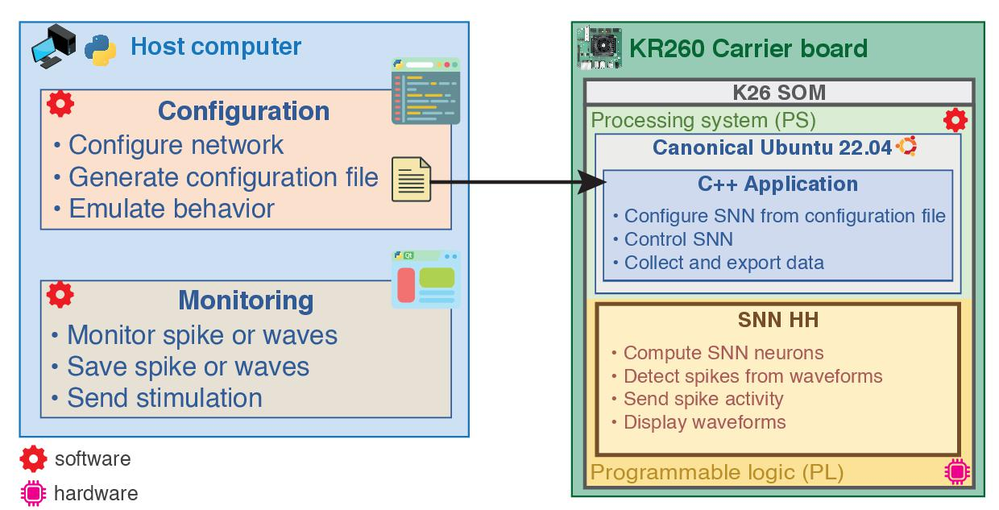
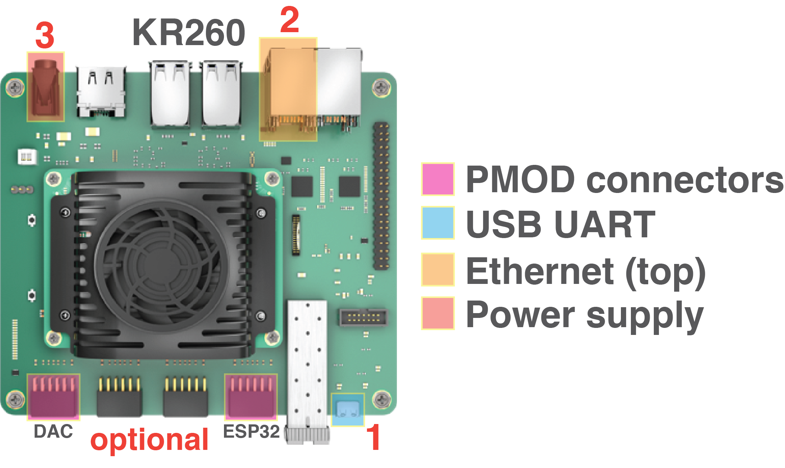

# Get Started

## Overview

**Overview of the system architecture**


**Network configuration file**


**Monitoring channels**


## Setup Ubuntu operating system

This steps prepares the operating system to run BioemuS on KR260 or KV260 targets.

* Download Canonical Ubuntu image for AMD target from [here](https://ubuntu.com/download/amd-xilinx)
  * Ubuntu 20.04
  * Ubuntu 22.04 (:warning:**KV260**: not supported from stock, [boot firmware update required](https://xilinx-wiki.atlassian.net/wiki/spaces/A/pages/1641152513/Kria+SOMs+Starter+Kits))
> _Official tutorials_
>* [Kria™ KR260 Getting Started Guide for Ubuntu 22.04](https://www.amcom/en/products/system-on-modules/kria/k26/kr260-robotics-starter-kigetting-started/getting-started.html)
>* [Kria™ KV260 Getting Started Guide for Ubuntu 22.04](https://www.amcom/en/products/system-on-modules/kria/k26/kv260-vision-starter-kigetting-started/getting-started.html)
* Flash image on SD card
* Insert SD card
* Connect USB serial (**1**) to PC (USB micro B)
  * USB to UART Bridge: Interface 0, 115200 baud
* Connect Ethernet (**2**) to PC or local network
  * SSH connection: @username ubuntu @port 22
* Connect power supply (**3**)


* Login to Ubuntu

``` Bash
# Default
login: ubuntu
password: ubuntu
# bioemus
login: ubuntu
password: kriachan
```

* Setup internet access
  <details>
  <summary>(1) Connected to local network</summary>
  
  * Connect Ethernet cable to the local network.
  </details>
  
  <details>
  <summary>(2) Shared over Ethernet</summary>
    
  * **Windows**: ⊞+R > control > Network & Internet > Center Network and share > (on side window) Modify board settings > (on your board connected to internet) right click > Properties > (Tab) Sharing > (Tick) authorize sharing > select board connected to the target Ethernet
    
  * **Linux** (Gnome): Network manager > Wired connection > Shared to other computers
  </details>

> _Internet connection can be checked using ```nmcli general status```_
>
> ```Bash
> % nmcli general status
> STATE      CONNECTIVITY  WIFI-HW  WIFI     WWAN-HW  WWAN
> connected  full          enabled  enabled  enabled  enabled
> ```

* Get the IP assigned to the board using ```ifconfig``` command (inet value of eth1, here 192.168.137.248)

``` Bash
ubuntu@kria:~$ ifconfig
eth0: flags=4099<UP,BROADCAST,MULTICAST>  mtu 1500
        ether 00:0a:35:0f:d6:48  txqueuelen 1000  (Ethernet)
        RX packets 0  bytes 0 (0.0 B)
        RX errors 0  dropped 0  overruns 0  frame 0
        TX packets 0  bytes 0 (0.0 B)
        TX errors 0  dropped 0 overruns 0  carrier 0  collisions 0
        device interrupt 38

eth1: flags=4163<UP,BROADCAST,RUNNING,MULTICAST>  mtu 1500
        inet 192.168.137.248  netmask 255.255.255.0  broadcast 192.168.137.255
        inet6 fe80::e83c:990d:d8ba:55e7  prefixlen 64  scopeid 0x20<link>
        ether 00:0a:35:0f:e0:79  txqueuelen 1000  (Ethernet)
        RX packets 109  bytes 17011 (17.0 KB)
        RX errors 0  dropped 0  overruns 0  frame 0
        TX packets 96  bytes 9737 (9.7 KB)
        TX errors 0  dropped 0 overruns 0  carrier 0  collisions 0
        device interrupt 37

lo: flags=73<UP,LOOPBACK,RUNNING>  mtu 65536
        inet 127.0.0.1  netmask 255.0.0.0
        inet6 ::1  prefixlen 128  scopeid 0x10<host>
        loop  txqueuelen 1000  (Local Loopback)
        RX packets 274  bytes 21577 (21.5 KB)
        RX errors 0  dropped 0  overruns 0  frame 0
        TX packets 274  bytes 21577 (21.5 KB)
        TX errors 0  dropped 0 overruns 0  carrier 0  collisions 0
```

> **eth0**: bottom PS Ethernet port
> **eth1**: top PS Ethernet port

* Start SSH session at the IP address (MobaXterm, or console if Linux)

```Bash
# MobaXterm
Remote host: 192.168.137.248
Username: ubuntu
Port: 22
# Linux
ssh ubuntu@192.168.137.248
```

* Update system

```Bash
sudo apt-get update && sudo apt upgrade
sudo reboot now
```
> On Kria™ KR260 the boot time can be quite long (~180 seconds) from the TPM self test message.

* Install Xilinx Development Tools package

``` Bash
# Ubuntu 20.04
sudo snap install xlnx-config --classic --channel=1.x
# Ubuntu 22.04
sudo snap install xlnx-config --classic --channel=2.x

# Initialize xilinx config package
xlnx-config.sysinit

# Bootgen
sudo apt install bootgen-xlnx
```

* Install BioemuS dependencies

``` Bash
# ZeroMQ
sudo apt install libzmq3-dev
# Python
sudo apt install python3-pip python3-pyqt5
```

* (optional, install Ubuntu Software)

``` Bash
sudo snap install snap-store
```

* (optional, utilities)

``` Bash
sudo apt install net-tools
sudo apt install devmem2
```

* (optional, disable GUI for remote use)

```Bash
# Disable GUI
sudo systemctl set-default multi-user
# Enable GUI
sudo systemctl set-default graphical
```

## Setup Bioemus

This procedure "installs" Bioemus on the board by building the different requirements for Bioemus to run.

* Copy ```sw/target/kria``` on the board at ```~/``` or ```/home/ubuntu``` (i.e. using SFTP with MobaXterm, USB drive, ...) or clone from github.
```
git clone https://github.com/Ceramic-Blue-Tim/bioemus.git gitbioemus
cp -r gitbioemus/sw/target/kria bioemus
```
* Rename folder to ```bioemus```
```Bash
mv kria bioemus
```
* Run initialization

```Bash
cd bioemus
chmod +x init.sh
source ./init.sh
echo "source ${BIOEMUS_PATH}/init.sh" >> ~/.bashrc
```

> In case of scripts not running, try converting all .sh to unix format using `dos2unix` (`sudo apt install dos2unix` then `dos2unix *.sh`)

* Build all recipes (software: C++ application, firmware: device tree and bitstream platform, drivers: DMA proxy driver)

```Bash
./build.sh
```

> The different depedencies can be build independently by passing the arguments ```software|firmware|drivers```.

## Generate configuration files

This step details the generation of the configuration files of the system performed on the host computer. There are two configuration files: one to configure the C++ application (.json) and one to configure the SNN (.txt). Both files are generated by the Python but only the .json can be modified after generation.

Detailed procedure to generate configuration file can be found [here](gen_netw_conf.md).

### Create python environment using conda

* Create the environment

```Bash
conda create -n bioemus python=3.11
```

* Install packages required

```Bash
conda activate bioemus
pip install -r host/requirements.txt
```

### Generate configuration files from notebook

* Open the ```host``` folder in VSCode and open the file ```main.ipynb```
* Run the _Generate configuration file_ section
* Default path for configuration files is ```host/export/```

> The parameters have to be described in the file ```gen_config.py```

### Transfer configuration files to the board

* Transfer configuration files (.json and .txt) on the board in the folder ```bioemus/config/```

## Run Bioemus

### Application settings

* Application settings can be modified from the JSON configuration file

```json
{
    "fpath_hwconfig": "/home/ubuntu/bioemus/config/hwconfig_stim.txt",
    "emulation_time_s": 10,
    "sel_nrn_vmem_dac": [0, 1, 2, 3, 4, 5, 6, 7],
    "sel_nrn_vmem_dma": [0, 1, 2, 3, 4, 5, 6, 7, 8, 9, 10, 11, 12, 13, 14, 15],
    "save_local_spikes": false,
    "save_local_vmem": false,
    "save_path": "/home/ubuntu/bioemus/data/",
    "en_zmq_spikes": true,
    "en_zmq_vmem": false,
    "en_zmq_stim": true,
    "en_wifi_spikes": false,
    "ip_zmq_spikes": "tcp://*:5557",
    "ip_zmq_vmem": "tcp://*:5558",
    "ip_zmq_stim": "tcp://192.168.137.1:5559",
    "bin_fmt_save_spikes": false,
    "bin_fmt_save_vmem": false,
    "bin_fmt_send_spikes": false,
    "bin_fmt_send_vmem": false,
    "nb_tstamp_per_spk_transfer": 100,
    "nb_tstep_per_vmem_transfer": 190,
    "en_stim": false,
    "stim_delay_ms": 5,
    "stim_duration_ms": 20
}
```

* **Example**: saving local spikes and external stimulation

```json
{
    "save_local_spikes": true,
    "save_path": "/home/ubuntu/bioemus/data/",
    "en_zmq_stim": true,
    "ip_zmq_stim": "tcp://192.168.137.1:5559",
    "nb_tstamp_per_spk_transfer": 100,
}
```

* **Example**: stimulation step and store local waves

```json
{
    "sel_nrn_vmem_dma": [0, 1, 2, 3, 4, 5, 6, 7, 8, 9, 10, 11, 12, 13, 14, 15],
    "save_local_vmem": true,
    "save_path": "/home/ubuntu/bioemus/data/",
    "nb_tstep_per_vmem_transfer": 190,
    "en_stim": true,
    "stim_delay_ms": 5,
    "stim_duration_ms": 20
}
```


### Run application
* Run application

```Bash
./launch_app.sh <path_to_swconfig_file_json>
```

## Monitor using ZeroMQ

* Either run ```run_spkmon.py``` or the spike monitoring section from _Monitoring_ in ```main.ipynb```.
* Set the IP address of the board and port for spikes (5557)

```Bash
tcp://192.168.137.248:5557
```

* Press the connect button

> * /!\ **NB_FRAME_PER_BUFFER** in ```monitoring/spkmon/spkmon/settings/config.py``` must be identical to "nb_tstamp_per_spk_transfer" (default 100)
> * ZeroMQ sending has to be enabled in the .json file
> * Smaller window width limits GUI freezing
