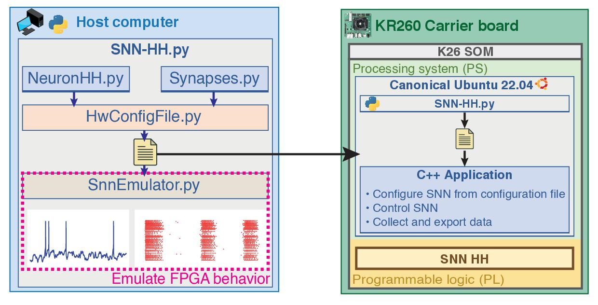

# Generate network configuration

**Network configuration scripts**


## Create python environment using conda

* Create the environment

```Bash
conda create -n bioemus python=3.11
```

* Install packages required

```Bash
conda activate bioemus
pip install -r host/requirements.txt
```

## Modify ion channel states equations

* Open `/sw/host/configuration/neurons/Ionrates.py`

* Edit the `Pospischil` class or use it to create your own class.

* Add the equations for α(V) / β(V) or ∞(V) / 𝜏(V) for each channel in functions `<alpha/beta>_<m/h>_<ion>`.
* Update the emulation model in `calc_<m/h>_<ion>` function

```python
def alpha_m_Na(self, v): return ((-0.32*(v-self.V_T-13)) / (exp(-(v-self.V_T-13)/4)-1))
def  beta_m_Na(self, v): return ((+0.28*(v-self.V_T-40)) / (exp((v-self.V_T-40)/5)-1))
def  calc_m_Na(self, v, mpre, dt) -> np.float64: 
    dx = self.alpha_m_Na(v)*(1-mpre) - self.beta_m_Na(v)*mpre
    return forwardEuler(dx, mpre, dt)
```

```python
def   xinf_M(self, v): return 1.0/(1.0+exp(-(v+35.0)/10.0))
def   taux_M(self, v): return 1.0/(3.3*exp((v+35.0)/20.0) + exp(-(v+35.0)/20.0))
def calc_m_M(self, v, mpre, dt)-> np.float64:
    dx = (self.xinf_M(v)-mpre)/self.taux_M(v)
    return forwardEuler(dx, mpre, dt)
```

* Update `getIonRates()` function to use the class created

```python
for v in v_ramp:
    # Na
    mNa_r1.append( r1_hines(model.alpha_m_Na(v), model.beta_m_Na(v), dt))
    mNa_r2.append( r2_hines(model.alpha_m_Na(v), model.beta_m_Na(v), dt))
    hNa_r1.append( r1_hines(model.alpha_h_Na(v), model.beta_h_Na(v), dt))
    hNa_r2.append( r2_hines(model.alpha_h_Na(v), model.beta_h_Na(v), dt))
    # K
    mK_r1.append( r1_hines(model.alpha_m_K(v), model.beta_m_K(v), dt) )
    mK_r2.append( r2_hines(model.alpha_m_K(v), model.beta_m_K(v), dt) )
    # M
    mM_r1.append( r1(model.xinf_M(v), model.taux_M(v), dt) )
    mM_r2.append( r2(model.xinf_M(v), model.taux_M(v), dt) )
    # L
    mL_r1.append( r1_hines(model.alpha_m_L(v), model.beta_m_L(v), dt))
    mL_r2.append( r2_hines(model.alpha_m_L(v), model.beta_m_L(v), dt))
    hL_r1.append( r1_hines(model.alpha_h_L(v), model.beta_h_L(v), dt))
    hL_r2.append( r2_hines(model.alpha_h_L(v), model.beta_h_L(v), dt))
    # T
    mT_r1.append( 0.0 )
    mT_r2.append( model.xinf_T_m(v) )
    hT_r1.append( r1(model.xinf_T_h(v), model.taux_T_h(v), dt) )
    hT_r2.append( r2(model.xinf_T_h(v), model.taux_T_h(v), dt) )

    
m_rates1.append(mNa_r1) ; m_rates2.append(mNa_r2)   # Na
m_rates1.append(mK_r1)  ; m_rates2.append(mK_r2)    # K
m_rates1.append(mM_r1)  ; m_rates2.append(mM_r2)    # M
m_rates1.append(mL_r1)  ; m_rates2.append(mL_r2)    # L
m_rates1.append(mT_r1)  ; m_rates2.append(mT_r2)    # T

h_rates1.append(hNa_r1) ; h_rates2.append(hNa_r2)   # Na
h_rates1.append(ones)   ; h_rates2.append(ones)     # K
h_rates1.append(ones)   ; h_rates2.append(ones)     # M
h_rates1.append(hL_r1)  ; h_rates2.append(hL_r2)    # L
h_rates1.append(hT_r1)  ; h_rates2.append(hT_r2)    # T
```

> :warning: **RATE_VMIN**, **RATE_VMAX** and **RATE_TABLE_SIZE** are hardware locked

## Modify neuron parameters

* Open `/sw/host/configuration/neurons/HHparam.py`
* Edit existing type or create a new type by copying an existing one
```python
elif nt[0] == "my_neuron_type":
    cmem                             = 1.0           # (µF/cm²)
    area_cm2                         = 67e-4*67e-4   # (cm²)
    hhparam[self.PID["G_Na"]]        = 50e-3         # (S/cm²)
    hhparam[self.PID["G_Kd"]]        =  5e-3         # (S/cm²)
    hhparam[self.PID["G_M"]]         = 0.0           # (S/cm²)
    hhparam[self.PID["G_L"]]         = 0.0           # (S/cm²)
    hhparam[self.PID["G_T"]]         = 0.0           # (S/cm²)
    hhparam[self.PID["G_Leak"]]      = 0.15e-3      # (S/cm²)
    hhparam[self.PID["E_Na"]]        = +50.0         # (mV)
    hhparam[self.PID["E_K"]]         = -100.0        # (mV)
    hhparam[self.PID["E_Ca"]]        = 0.0           # (mV)
    hhparam[self.PID["E_Leak"]]      = -70.0         # (mV)
    if not("nonoise" in nt):
        hhparam[self.PID["mu"]]      = 0.048         # 0.05
        hhparam[self.PID["theta"]]   = 8.0           # 8.0
        hhparam[self.PID["sigma"]]   = 0.11          # 0.1
    if not("nostim" in nt):
        hhparam[self.PID["i_stim"]]  = 0.01/3 # 0.0075 # 0.03          # (mA/cm²)
    hhparam[self.PID["v_init"]]      = -70.0         # (mV)
```
## Modify synapse parameters

* Open `/sw/host/configuration/synapses/Synapses.py`
* Edit parameters for synaptic receptors
```python
psyn[PID["AMPA_K1"]]    = 1.1e6 *1e-6   # [1/(mM.ms)]
psyn[PID["AMPA_K2"]]    = 190   *1e-3   # [1/ms]
psyn[PID["AMPA_Gsyn"]]  = 0.35          # 0.35 to 1.0 [nS]
psyn[PID["AMPA_Esyn"]]  = 0.0           # [mV]
psyn[PID["NMDA_K1"]]    = 7.2e4 *1e-6   # [1/(mM.ms)]
psyn[PID["NMDA_K2"]]    = 6.6   *1e-3   # [1/sec]
psyn[PID["NMDA_Gsyn"]]  = 0.30          # 0.01 to 0.6 [nS]
psyn[PID["NMDA_Esyn"]]  = 0.0           # [mV]
psyn[PID["GABAa_K1"]]   = 5e6 *1e-6     # [1/(mM.ms)]
psyn[PID["GABAa_K2"]]   = 180 *1e-3     # [1/sec]
psyn[PID["GABAa_Gsyn"]] = 0.25          # 0.25 to 1.2 [nS]
psyn[PID["GABAa_Esyn"]] = -80.0         # [mV]
psyn[PID["GABAb_K1"]]   = 9e4   * 1e-6  # [1/(mM.ms)]
psyn[PID["GABAb_K2"]]   = 1.2   * 1e-3  # [1/ms]
psyn[PID["GABAb_K3"]]   = 180   * 1e-3  # [1/ms]
psyn[PID["GABAb_K4"]]   = 34    * 1e-3  # [1/ms]
psyn[PID["GABAb_Gsyn"]] = 1.00          # 1.0 [nS]
psyn[PID["GABAb_Esyn"]] = -95           # [mV]
psyn_GABAb_Kd           = 100           #
psyn_GABAb_n            = 4             # nb binding sites
```

## Custom network configuration

* Open `/sw/host/configuration/gen_config.py`
* Assign neuron types

```python
# Custom model #################################################################
    if MODEL == "custom":
        # Initialize all neurons as FS
        tnrn    = ["FS"]*NB_NEURONS

        # Set ranges of neurons
        for i in range(0,511,1):
            tnrn[i]  = "FS"
        for i in range(512,1023,1):
            tnrn[i]  = "RS"

        # Set specific neurons
        tnrn[0] = "FS"
        tnrn[1] = "RS"
        tnrn[2] = "IB"
        tnrn[3] = "LTS"
        tnrn[4] = "FS_nonoise_nostim"
        tnrn[5] = "my_neuron_type"
```

* Create synaptic connection
    * "destexhe_ampa"  : AMPAR
    * "destexhe_nmda"  : NMDAR
    * "destexhe_gabaa" : GABAAR
    * "destexhe_gabab" : GABABR
    * "destexhe_none"  : X

```python
# Example of connection rules
SYN_MODE = "NONE"
# SYN_MODE = "CHASER"
# SYN_MODE = "RANDOM"
# SYN_MODE = "ONE_TO_ALL"
# SYN_MODE = "ONE_TO_ONE"

# Synaptic types
#      | source |
# -----|--------|
# dest |        |
tsyn_dict = Synapses().getDict()
weight = 1.0
for dest in range(NB_NEURONS):
    for src in range(NB_NEURONS):

        # No connection
        if SYN_MODE == "NONE":
            tsyn_i = "destexhe_none"

        # Propagating from neuron 0 to 1024 in a chaser fashion
        elif SYN_MODE == "CHASER":
            if ((src+1) == dest):
                tsyn_i = "destexhe_ampa"
            else:
                tsyn_i = "destexhe_none"

        # Randomly connecting the first 100 neurons
        elif SYN_MODE == "RANDOM":
            if (dest < 100) and (src < 100):
                if dest != src:
                    if (np.random.rand() < 0.2):
                        tsyn_i = "destexhe_ampa"
                    else:
                        tsyn_i = "destexhe_none"
                else:
                    tsyn_i = "destexhe_none"
            else:
                tsyn_i = "destexhe_none"

        # Connecting given neurons manually (N0->N1 and N1->N2)
        elif SYN_MODE == "ONE_TO_ONE":
            if src==0 and dest==1:
                tsyn_i = "destexhe_gabab"
            elif src==1 and dest==2:
                tsyn_i = "destexhe_gabab"
            else:
                tsyn_i = "destexhe_none"

        # Connecting one neuron to all the others
        elif SYN_MODE == "ONE_TO_ALL":
            if src==0 and dest != 0:
                tsyn_i = "destexhe_gabaa"
            else:
                tsyn_i = "destexhe_none"
```

## Modify default application settings

* Open `/sw/host/configuration/gen_config.py`
```python
# Application parameters ########################################
swconfig_builder                                           = SwConfigFile()
swconfig_builder.parameters["fpath_hwconfig"]              = "/home/ubuntu/bioemus/config/hwconfig_" + config_fname + ".txt"
swconfig_builder.parameters["emulation_time_s"]            = netw_conf_params.emulation_time_s
...
```

## Generate configuration files

* Open `/sw/host/main.ipynb`
* Run _Generate configuration file_ cell
```python
%load_ext autoreload
%autoreload 2
from configuration.gen_config import gen_config, NetwConfParams

# Configuration file 
CONFIG_NAME = "example"
SAVE_PATH   = "export/"

# Stimulation
netw_conf = NetwConfParams()
netw_conf.model                     = "custom" # "custom", "single", "connectoid"
netw_conf.emulation_time_s          = 300       # Set emulation time (s)
netw_conf.en_step_stim              = False     # Enable stimulation step
netw_conf.step_stim_delay_ms        = 0         # Stimulation step delay (ms)
netw_conf.step_stim_duration_ms     = 0         # Stimulation duration (ms)
netw_conf.local_save_path           = "/home/ubuntu/bioemus/data/" # Save path on target
netw_conf.en_randomize_hh_params    = True  # Randomizing HH parameters for all neurons
netw_conf.val_randomize_hh_params   = 0.10  # Randomization coefficient (0.1 -> 10%)
netw_conf.org_wsyninh               = 1.0   # Organoid synaptic weight inhibition
netw_conf.org_wsynexc               = 0.22  # Organoid synaptic weight excitatory
netw_conf.org_pcon_in               = 0.08  # Organoid max connection probability internal
netw_conf.org_pcon_out              = 0.02  # Organoid max connection probability external
netw_conf.org_wsyn_in               = 1.0   # Organoid synaptic weight internal
netw_conf.org_wsyn_out              = 1.0   # Organoid synaptic weight external
netw_conf.org_inh_ratio             = 0.2   # Organoid inhibitory ratio (0.2->20% of inh)

[hwconfig, swconfig] = gen_config(CONFIG_NAME, netw_conf, SAVE_PATH)
```

> The following configuration files should be generated:
> * export/hwconfig_example.txt
> * export/swconfig_example.json